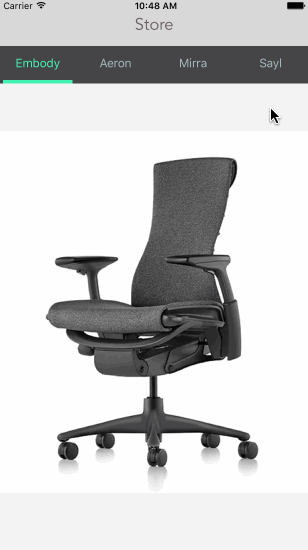
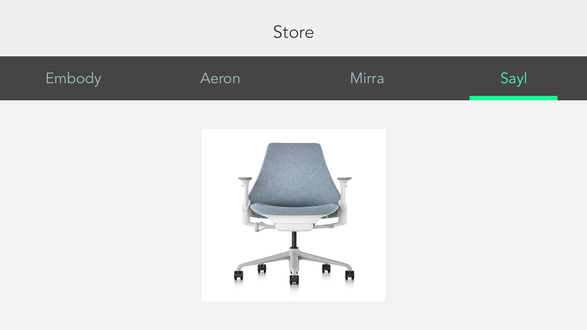
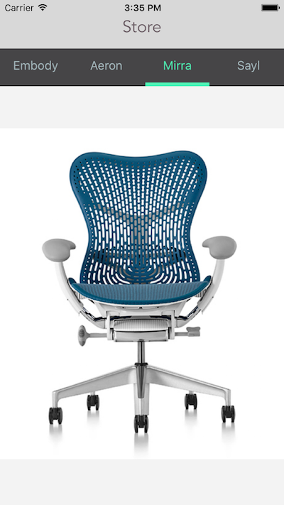

# HHSlideView (Upgraded)

## New Feature
1. Support horizontal screen;
2. Slider with POP animation.

An custom segment control view with flat style.

HHSlideView is a falt view with segment control function. It's easy to be integrated into your project.

 

## Installation
###Manual
Adding `HHSlideView.h` and `HHSlideView.m` to your project. And you need to import `Masonry framework` and `POP framework`.
## How To Use
**1. Create a super view controller. The slideView will become the subview of it.**

	- (void)viewDidLoad {
	    [super viewDidLoad];
	    
	    [self.view addSubview:self.slideView];
	}
	
	- (HHSlideView *)slideView {
	    
	    if (!_slideView) {
	        
	        NSArray *itemsArray = [[NSArray alloc] initWithObjects:@"Embody", @"Aeron", @"Mirra", @"Sayl",nil];
	        _slideView = [[HHSlideView alloc] initWithItemsArray:itemsArray];
	        _slideView.delegate = self;
	        _slideView.dataSource = self;
	    }
	    return _slideView;
	}
**2. Set layout for the slideView.**

	- (void)viewDidLayoutSubviews {
	    [super viewDidLayoutSubviews];
	    
	    [_slideView mas_makeConstraints:^(MASConstraintMaker *make) {
	        make.left.and.right.equalTo(self.view);
	        make.top.equalTo(@64);
	        make.height.equalTo(self.view.mas_height);
	    }];
	}
**3. Create several child view controllers. They will be orgnized by the slideView. Implement the method in HHSlideView DataSource.**
	
	- (NSArray *)childViewControllersInSlideView:(HHSlideView *)slideView {
	    
	    SubViewController *subVC_1 = [[SubViewController alloc] initWithImage:[UIImage imageNamed:@"embody_chair"]];
	    SubViewController *subVC_2 = [[SubViewController alloc] initWithImage:[UIImage imageNamed:@"aeron_chair"]];
	    SubViewController *subVC_3 = [[SubViewController alloc] initWithImage:[UIImage imageNamed:@"mirra2_chair"]];
	    SubViewController *subVC_4 = [[SubViewController alloc] initWithImage:[UIImage imageNamed:@"sayl_chair"]];
	
	    NSArray *childViewControllersArray = @[subVC_1, subVC_2, subVC_3, subVC_4];
	    
	    return childViewControllersArray;
	}
**4. There are some HHSlideView Delegate methods. Depending on your needs, decide whether you will achieve it or not.**

	- (UIColor *)colorOfBar:(HHSlideView *)slideView {
	    
	    return [UIColor greenColor];
	}
	
## Creator

**Herbert Hu**

[Blog](http://my.oschina.net/herbert77)  

## License

The MIT License (MIT)

Copyright (c) 2017 Herbert Hu

Permission is hereby granted, free of charge, to any person obtaining a copy
of this software and associated documentation files (the "Software"), to deal
in the Software without restriction, including without limitation the rights
to use, copy, modify, merge, publish, distribute, sublicense, and/or sell
copies of the Software, and to permit persons to whom the Software is
furnished to do so, subject to the following conditions:

The above copyright notice and this permission notice shall be included in all
copies or substantial portions of the Software.

THE SOFTWARE IS PROVIDED "AS IS", WITHOUT WARRANTY OF ANY KIND, EXPRESS OR
IMPLIED, INCLUDING BUT NOT LIMITED TO THE WARRANTIES OF MERCHANTABILITY,
FITNESS FOR A PARTICULAR PURPOSE AND NONINFRINGEMENT. IN NO EVENT SHALL THE
AUTHORS OR COPYRIGHT HOLDERS BE LIABLE FOR ANY CLAIM, DAMAGES OR OTHER
LIABILITY, WHETHER IN AN ACTION OF CONTRACT, TORT OR OTHERWISE, ARISING FROM,
OUT OF OR IN CONNECTION WITH THE SOFTWARE OR THE USE OR OTHER DEALINGS IN THE
SOFTWARE.
